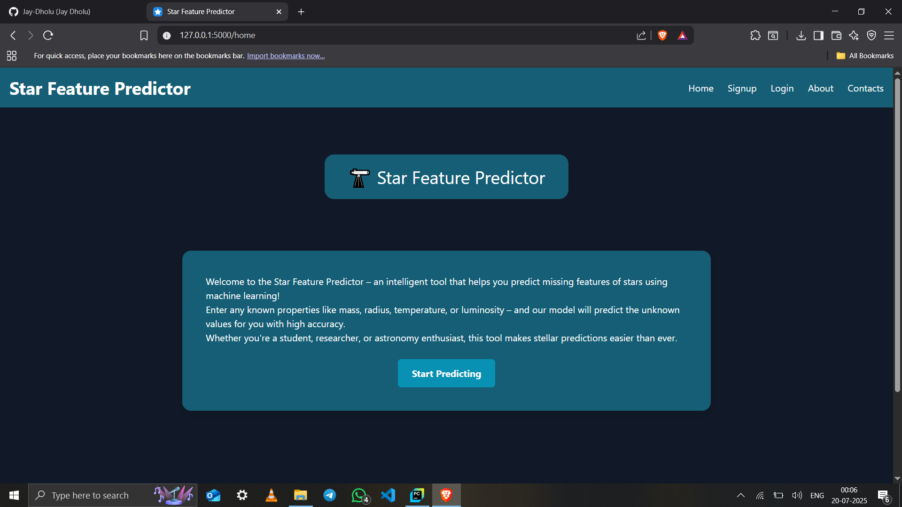

# Star Feature Predictor 🌟

Predict stellar properties with our model!
A machine learning-powered web application that predicts stellar properties like temperature, radius, luminosity, spectral class, and more — given the remaining features. Built using Flask, Scikit-learn, SQLAlchemy, and joblib.

## Preview

## Features

- Predict any one star feature when others are known
- Models include classification and regression (Random Forest, Logistic Regression, etc.)
- Intelligent pipelines with preprocessing, ColumnTransformers, and algorithm selection
- User authentication with sign-up/login
- View and delete prediction history
- Easy-to-use UI

## Tech Stack

| Category        |  Tools/Frameworks                          |
|-----------------|--------------------------------------------|
| **Backend**     |  Flask, SQLAlchemy, WTForms                |
| **ML**          |  scikit-learn, joblib, pandas, numpy       |
| **Frontend**    |  HTML5, CSS3, JavaScript                   |
| **Database**    |  SQLite                                    |
| **Deployment**  |  Render                                    |

## Contact

- Developer: Jay Dholu
- Email: jaydholu074@gamil.com
- GitHub: @Jay-Dholu
- LinkedIn: Jay Dholu

# “The cosmos is within us. We are made of star-stuff.” – Carl Sagan

## Note-

-Run the 'model-training.py' file to train the models and then all the models will be trained and stored in the folder called 'models'. And all set, you are ready to run web-app locally on your desktop.
